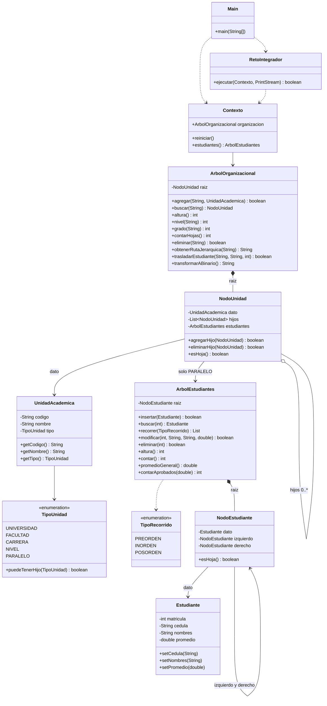

# Diagrama de clases

Clases del proyecto y sus relaciones (generado a partir del código fuente).

```mermaid
classDiagram
direction TB

class TipoUnidad {
  <<enumeration>>
  UNIVERSIDAD
  FACULTAD
  CARRERA
  NIVEL
  PARALELO
  +puedeTenerHijo(TipoUnidad) boolean
}
class TipoRecorrido {
  <<enumeration>>
  PREORDEN
  INORDEN
  POSORDEN
}

class UnidadAcademica {
  -String codigo
  -String nombre
  -TipoUnidad tipo
  +getCodigo() String
  +getNombre() String
  +getTipo() TipoUnidad
}
class Estudiante {
  -int matricula
  -String cedula
  -String nombres
  -double promedio
  +setCedula(String)
  +setNombres(String)
  +setPromedio(double)
}

class NodoUnidad {
  -UnidadAcademica dato
  -List~NodoUnidad~ hijos
  -ArbolEstudiantes estudiantes
  +agregarHijo(NodoUnidad) boolean
  +eliminarHijo(NodoUnidad) boolean
  +esHoja() boolean
}
class ArbolOrganizacional {
  -NodoUnidad raiz
  +agregar(String, UnidadAcademica) boolean
  +buscar(String) NodoUnidad
  +altura() int
  +nivel(String) int
  +grado(String) int
  +contarHojas() int
  +eliminar(String) boolean
  +obtenerRutaJerarquica(String) String
  +trasladarEstudiante(String, String, int) boolean
  +transformarABinario() String
}
class NodoEstudiante {
  -Estudiante dato
  -NodoEstudiante izquierdo
  -NodoEstudiante derecho
  +esHoja() boolean
}
class ArbolEstudiantes {
  -NodoEstudiante raiz
  +insertar(Estudiante) boolean
  +buscar(int) Estudiante
  +recorrer(TipoRecorrido) List
  +modificar(int, String, String, double) boolean
  +eliminar(int) boolean
  +altura() int
  +contar() int
  +promedioGeneral() double
  +contarAprobados(double) int
}

class Contexto {
  +ArbolOrganizacional organizacion
  +reiniciar()
  +estudiantes() ArbolEstudiantes
}
class RetoIntegrador {
  +ejecutar(Contexto, PrintStream) boolean
}
class Main {
  +main(String[])
}

UnidadAcademica --> TipoUnidad
ArbolOrganizacional *-- NodoUnidad : raiz
NodoUnidad o-- NodoUnidad : hijos 0..*
NodoUnidad --> UnidadAcademica : dato
NodoUnidad --> ArbolEstudiantes : solo PARALELO
ArbolEstudiantes *-- NodoEstudiante : raiz
NodoEstudiante --> NodoEstudiante : izquierdo y derecho
NodoEstudiante --> Estudiante : dato
ArbolEstudiantes ..> TipoRecorrido
Contexto --> ArbolOrganizacional
Main ..> Contexto
Main ..> RetoIntegrador
RetoIntegrador ..> Contexto
```

